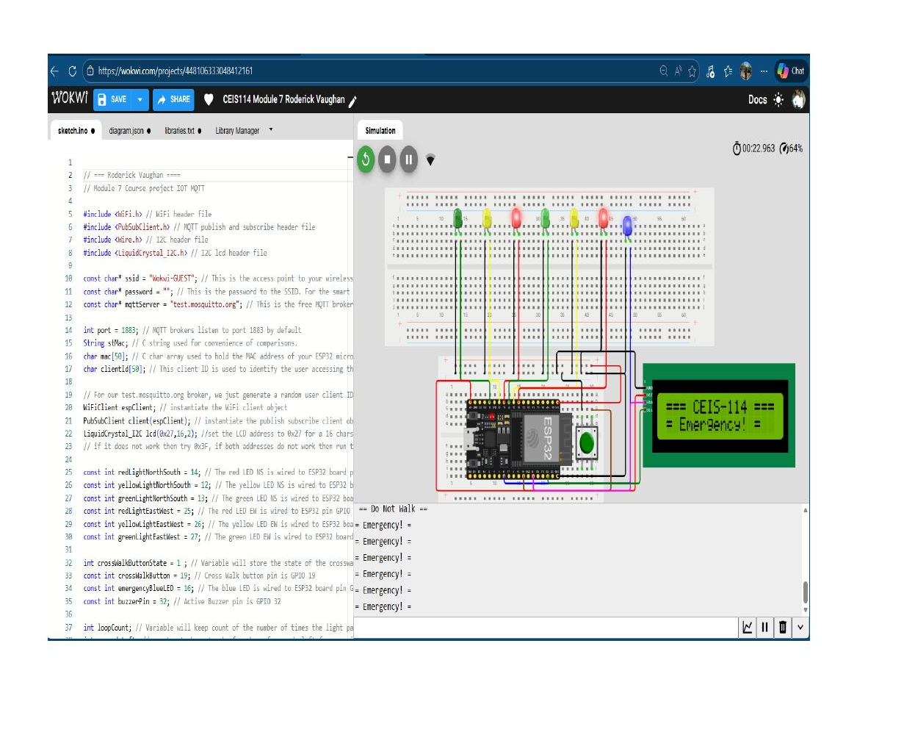
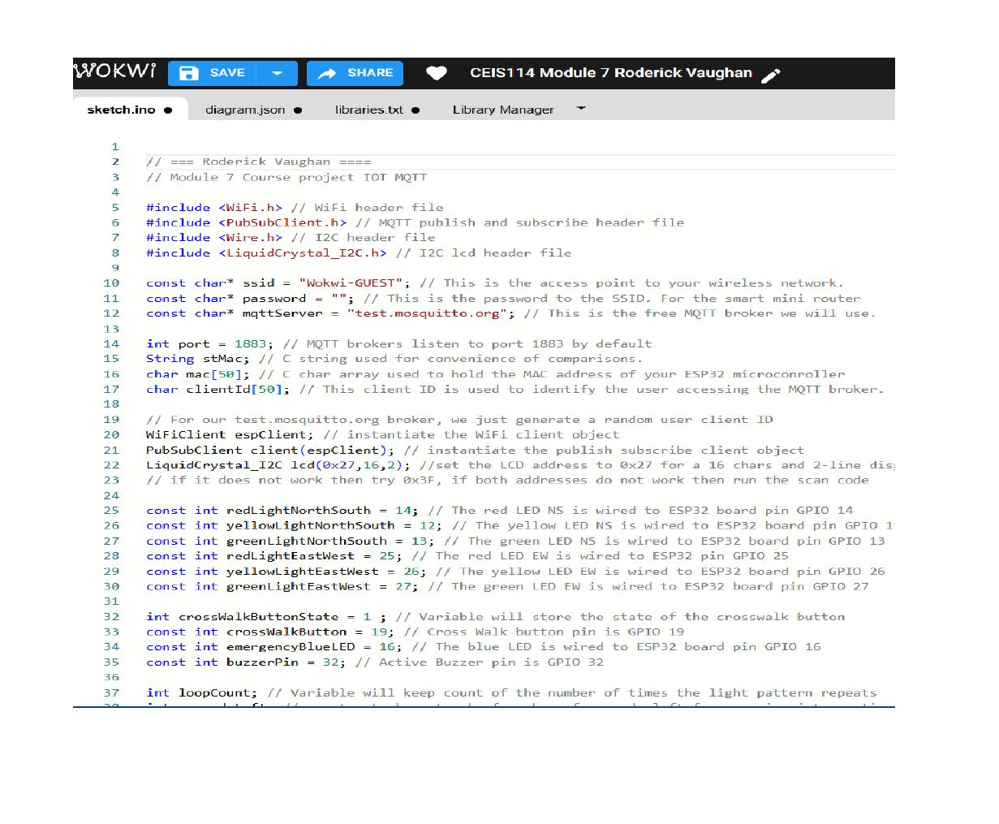
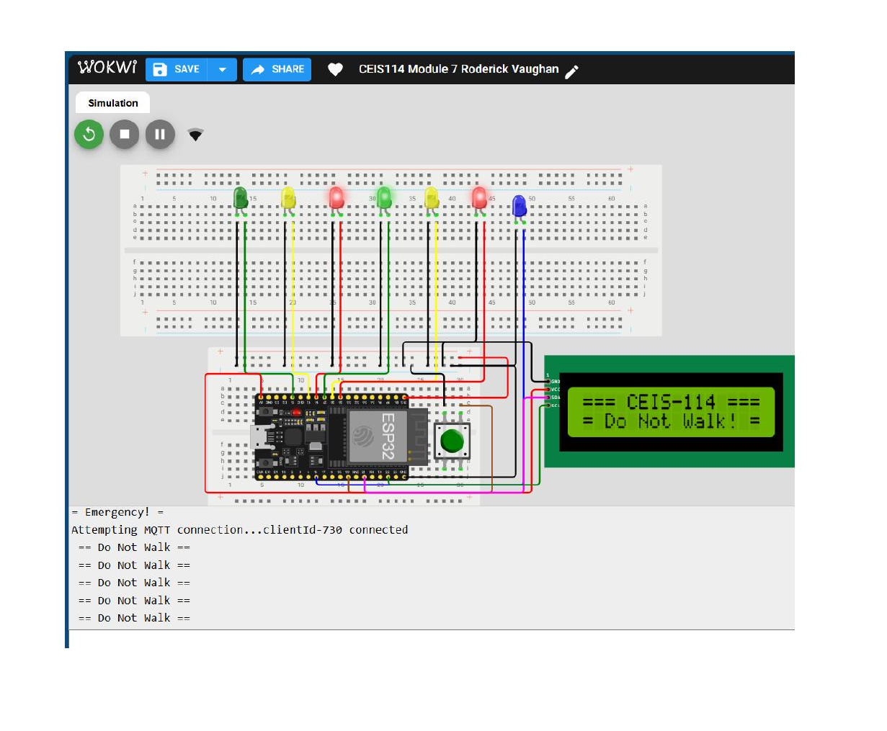

# ESP32 Traffic Light Controller — IoT MQTT

A dual-intersection traffic light controller built on an ESP32 microcontroller with crosswalk functionality, emergency override, LCD status display, and IoT remote control via MQTT over WiFi.

> **Course project** — CEIS 114, Module 7. Simulated in Wokwi and documented for portfolio.

---

## Overview

This project implements a fully functional traffic light controller simulating a real-world intersection with North/South and East/West signal sets. The system operates autonomously cycling through traffic light phases, responds to a physical crosswalk button press, and can be remotely switched into emergency mode via an MQTT message published over WiFi.

---

## Background

Built as part of a college IoT course (CEIS 114) by a veteran and cybersecurity professional with a background in DoD telecommunications and low-voltage systems.

The source code and circuit design were provided as part of the course curriculum. The author's work involved wiring the circuit in the Wokwi simulation environment, verifying all connections matched the schematic, testing functionality, and documenting the results. This README was prepared with AI assistance (Claude by Anthropic) for portfolio documentation purposes.

---

## Features

- Dual traffic light sets — North/South and East/West LED signals (Red, Yellow, Green)
- Crosswalk button with interrupt-driven detection and 15-second pedestrian crossing timer
- Countdown timer displayed on 16x2 I2C LCD display
- Emergency mode — triggered via MQTT `ON` message, activates blue LED and buzzer, holds all signals red
- Normal mode restored via MQTT `OFF` message
- Serial monitor output for real-time debugging and status
- Debounce logic on crosswalk button (20ms threshold)
- WiFi connection via Wokwi guest network
- MQTT broker — `test.mosquitto.org` (public broker, port 1883)

---

## Hardware Components

| Component | GPIO Pin | Description |
|---|---|---|
| Red LED (North/South) | GPIO 14 | NS red signal |
| Yellow LED (North/South) | GPIO 12 | NS yellow signal |
| Green LED (North/South) | GPIO 13 | NS green signal |
| Red LED (East/West) | GPIO 25 | EW red signal |
| Yellow LED (East/West) | GPIO 26 | EW yellow signal |
| Green LED (East/West) | GPIO 27 | EW green signal |
| Blue LED (Emergency) | GPIO 16 | Emergency indicator |
| Active Buzzer | GPIO 32 | Audio alert |
| Crosswalk Button | GPIO 19 | Pedestrian crossing trigger |
| LCD 1602 I2C | SDA: GPIO 21 / SCL: GPIO 22 | Status display (address 0x27) |
| ESP32 DevKit-C v4 | — | Microcontroller |

---

## Circuit Diagram

Built and simulated in [Wokwi](https://wokwi.com). The `diagram.json` file in this repo contains the full circuit layout and can be loaded directly into Wokwi to run the simulation.

> Open the simulation: paste `diagram.json` into a new Wokwi ESP32 project along with `sketch.ino`

---

## Screenshots

**Wokwi simulation — circuit running in emergency mode, LCD displaying "Emergency!", all signals red**


**Code editor — ESP32 sketch with author comment, WiFi and MQTT configuration visible**


**Serial monitor output — MQTT connection established, traffic cycle running, "Do Not Walk" state**


---

## How It Works

### Normal Traffic Cycle

1. NS Red on / EW cycles Green → Yellow → Red
2. EW Red on / NS cycles Green → Yellow → Red
3. Cycle repeats continuously
4. LCD displays "Do Not Walk" during normal operation

### Crosswalk Mode

1. Pedestrian presses crosswalk button (GPIO 19)
2. Interrupt fires — all signals hold red
3. LCD displays "Walk!" with 15-second countdown
4. Buzzer pulses during crossing period
5. System returns to normal cycle after timer expires

### Emergency Mode (IoT MQTT)

1. Publish `ON` to MQTT topic `LED` on `test.mosquitto.org`
2. All signals immediately hold red
3. Blue emergency LED strobes
4. Buzzer activates
5. LCD displays "Emergency!"
6. Publish `OFF` to restore normal operation

---

## MQTT Control

| Broker | `test.mosquitto.org` |
|---|---|
| Port | 1883 |
| Topic | `LED` |
| Message ON | Activate emergency mode |
| Message OFF | Restore normal operation |

Any MQTT client can be used to publish messages — MQTT Explorer, mosquitto_pub, or a mobile app.

```bash
# Trigger emergency mode
mosquitto_pub -h test.mosquitto.org -t LED -m "ON"

# Restore normal operation
mosquitto_pub -h test.mosquitto.org -t LED -m "OFF"
```

---

## Project Structure

```
esp32-traffic-light/
├── sketch.ino       # Main Arduino/ESP32 source code
├── diagram.json     # Wokwi circuit diagram
└── README.md
```

---

## Dependencies

| Library | Purpose |
|---|---|
| `WiFi.h` | ESP32 WiFi connectivity |
| `PubSubClient.h` | MQTT publish/subscribe client |
| `Wire.h` | I2C communication |
| `LiquidCrystal_I2C.h` | I2C LCD display driver |

Install via Arduino IDE Library Manager or PlatformIO.

---

## Running the Simulation

1. Go to [wokwi.com](https://wokwi.com) and create a new ESP32 project
2. Replace the default `sketch.ino` with the code from this repo
3. Replace `diagram.json` with the circuit file from this repo
4. Click **Start Simulation**
5. Open the Serial Monitor to watch traffic light state output
6. Click the green crosswalk button to trigger pedestrian mode
7. Use an MQTT client to publish to `test.mosquitto.org/LED` to test emergency mode

---

## Skills Demonstrated

- Embedded C++ programming on ESP32
- GPIO pin management and interrupt handling
- I2C protocol (LCD display)
- WiFi networking on embedded hardware
- MQTT publish/subscribe messaging
- IoT remote control architecture
- Hardware debounce logic
- State machine design for traffic control logic
- Wokwi circuit simulation

---

## Disclaimer

This project uses `test.mosquitto.org`, a public MQTT broker intended for testing only. Do not publish sensitive data to public brokers. For production IoT deployments, use a secured private broker with TLS and authentication.
